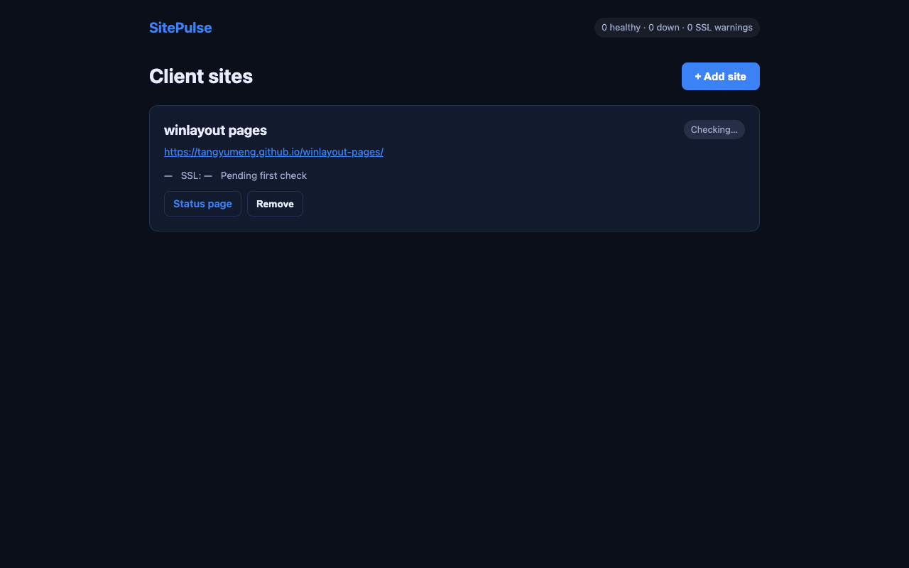

# SitePulse

**Client site health monitor for freelancers** — uptime + SSL expiry alerts in one dashboard.

## Why this exists

Freelancers managing 5–50 client websites need to know when a site goes down or an SSL cert expires **before the client calls**. Existing tools (Uptime Kuma, Healthchecks) are powerful but ops-heavy. SitePulse optimizes for:

- **10-second onboarding** — client name + URL, no agents
- **Client-centric UI** — not infrastructure-centric
- **Self-hosted first** — Docker one-liner, data stays yours

**Live:** https://site-pulse-brown.vercel.app  
**GitHub:** https://github.com/tangyumeng/site-pulse



## Quick start

```bash
cp .env.example .env
npm install
npm run dev
# Open http://localhost:4050/dashboard
```

### Docker

```bash
cp .env.example .env
docker compose up -d
```

## Features

- **10-second onboarding** — client name + URL
- **Uptime + SSL monitoring** — every 5 minutes
- **Public status page** — `/status/{siteId}` shareable with clients
- **Telegram/email alerts** — optional
- **Managed Cloud** — Stripe $9/mo, unlimited sites (see docs/ONE-TIME-AUTH.md)

## Daily ops

```bash
npm run check          # validate setup + site health
npm run daily-report   # JSON summary for cron
npm run growth-daily   # today's growth actions
npm run setup-stripe   # create Managed price (needs STRIPE_SECRET_KEY)
```

From self-hosted root:

```bash
bash scripts/daily-ops.sh
```

## Monetization (open-core)

| Tier | Price | Sites | Channel |
|------|-------|-------|---------|
| Self-hosted | $0 | 50 | GitHub + r/selfhosted |
| Managed Cloud | $9/mo | Unlimited | Gumroad/LemonSqueezy |

See [docs/MONETIZATION.md](./docs/MONETIZATION.md) and [docs/LAUNCH.md](./docs/LAUNCH.md).

## Target communities

- r/freelance, r/webdev, r/Wordpress — "how do you monitor client sites?"
- r/selfhosted — Show HN style launch with Docker
- Indie Hackers — build in public, freelancer pain angle

## Project structure

```
site-pulse/
├── src/           # Express API + scheduler
├── public/        # Landing + dashboard (no build step)
├── ops/           # Unattended scripts
├── skills/        # Reusable agent skills
└── docs/          # Launch + monetization playbooks
```
